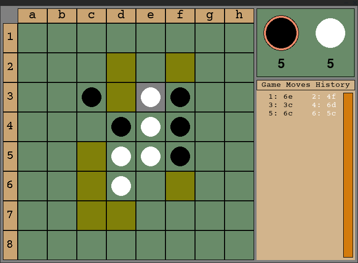

# Othello

An Othello game with the ability to play with a convolutional network.




### Used technologies:

- pygame
- Tensorflow
- Keras
- NumPy
- threading

### Install application
```shell
# Create virtual environment and activate it
python3 -m venv venv
source venv/bin/activate

# Install requirements
pip3 install -r requirements.txt

# run game
python3 othello.py
```

